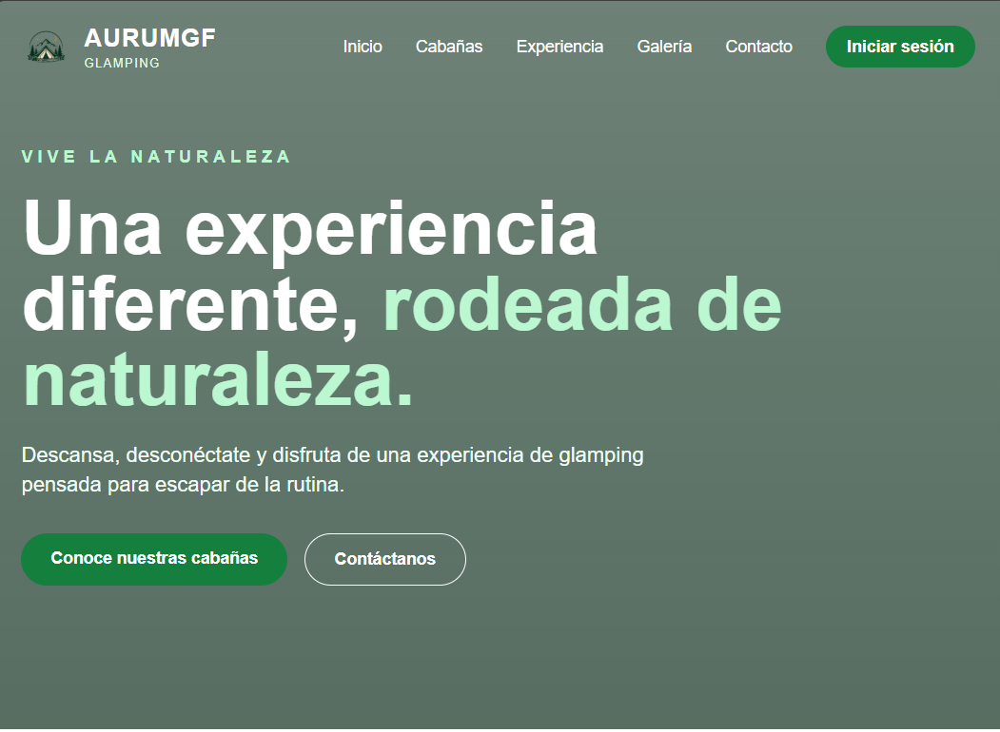
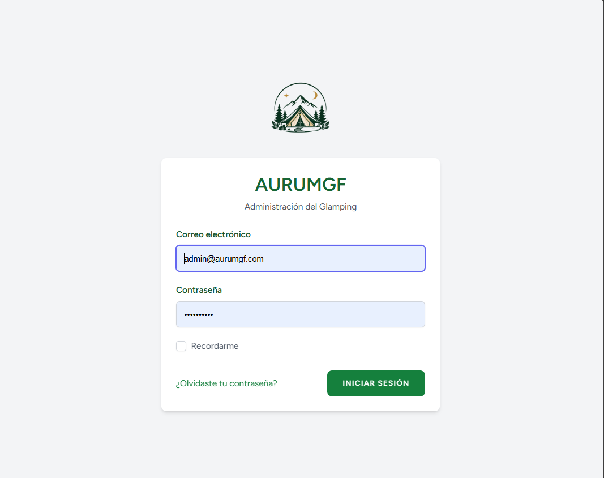

# AURUMGF - Sistema de Gestión para Glamping




Sistema web desarrollado para la gestión administrativa de un negocio de glamping, permitiendo administrar reservas, clientes y cabañas desde un panel administrativo.

El proyecto también cuenta con un sitio web público orientado a presentar las cabañas, servicios y experiencia ofrecida por el glamping.

## 📌 Descripción

AURUMGF es una aplicación web desarrollada para centralizar y facilitar la gestión de un negocio de glamping.

El sistema permite administrar la información de las cabañas, clientes y reservas, además de ofrecer funcionalidades de autenticación y un sitio web público para los visitantes.

Esta versión corresponde a la **versión 2.0 del proyecto**, desarrollada utilizando Laravel como framework principal.

## 🚀 Características

### 🌐 Sitio web público

- Página de inicio.
- Presentación del glamping.
- Sección de cabañas.
- Sección de experiencias.
- Galería de imágenes.
- Información de ubicación.
- Información de contacto.
- Acceso al sistema de reservas.

### 📊 Panel administrativo

- Dashboard administrativo.
- Visualización del total de reservas.
- Visualización del total de clientes.
- Visualización del total de cabañas.
- Accesos rápidos a los módulos principales.

### 📅 Gestión de reservas

- Registro de reservas.
- Consulta de reservas.
- Edición de reservas.
- Eliminación de reservas.
- Validación de disponibilidad.

### 👥 Gestión de clientes

- Registro de clientes.
- Consulta de clientes.
- Edición de información.
- Eliminación de clientes.

### 🏕️ Gestión de cabañas

- Registro de cabañas.
- Consulta de cabañas.
- Edición de información.
- Eliminación de cabañas.

### 🔐 Autenticación

- Registro de usuarios.
- Inicio de sesión.
- Cierre de sesión.
- Recuperación de contraseña.
- Cambio de contraseña.
- Verificación de correo electrónico.
- Actualización del perfil.
- Eliminación de cuenta.

### 📱 Diseño

- Diseño responsive.
- Interfaz adaptable a diferentes dispositivos.
- Interfaz desarrollada con Tailwind CSS.

## 🛠️ Tecnologías utilizadas

- PHP
- Laravel
- Blade
- Tailwind CSS
- JavaScript
- Vite
- MySQL
- Laravel Breeze
- Git
- GitHub

## 📁 Estructura del proyecto

```text
AURUMGF-Laravel/
├── app/
│   ├── Http/
│   ├── Models/
│   └── ...
├── database/
│   ├── migrations/
│   └── seeders/
├── public/
│   └── img/
├── resources/
│   ├── css/
│   ├── js/
│   └── views/
├── routes/
│   ├── web.php
│   └── auth.php
├── storage/
├── tests/
├── .env.example
├── artisan
├── composer.json
├── package.json
└── vite.config.js
```
## 🎯 Objetivo
Desarrollar un sistema web que permita gestionar de manera organizada las principales operaciones administrativas de un negocio de glamping, proporcionando herramientas para la administración de reservas, clientes y cabañas.
Además, el proyecto busca ofrecer una experiencia web moderna para los visitantes mediante un sitio público responsive.

## 🔄 Evolución del proyecto
AURUMGF comenzó como un proyecto desarrollado utilizando PHP y arquitectura MVC.

Posteriormente, el proyecto evolucionó hacia Laravel, incorporando un framework moderno, autenticación, Blade, Tailwind CSS, Vite y una estructura más organizada para facilitar su mantenimiento y escalabilidad.

AURUMGF 1.0

PHP + MVC

Primera versión del sistema desarrollada utilizando PHP y una arquitectura MVC.

AURUMGF 2.0

Laravel + Blade + Tailwind CSS + Vite

Segunda versión del proyecto, desarrollada utilizando Laravel como framework principal e incorporando nuevas funcionalidades y una interfaz renovada.


## 👨‍💻 Autor
**Alejandro Montoya**

Desarrollador de Software Junior | Backend

Con conocimientos en desarrollo web, bases de datos, desarrollo backend y tecnologías frontend.


